# DMN Engine #
DMN Engine is a rule engine allowing to execute and evaluate the decisions defined in a DMN  model. Its primary target is to evaluate the decision tables that transform the inputs into the output(s) using the decision rules. Simple expression decisions are also supported as well as the complex decision models containing set of dependent decisions (tables or expressions).
 
The DMN Model is defined using the adopted [standard](https://www.omg.org/spec/DMN/1.1/) XML file defined by OMG. Such definition can be designed for example using the [Camunda modeler](https://camunda.com/download/modeler/), keeping in mind the following principles how the file is parsed and the definition used in DMN Engine.

**NuGet package ID:** net.adamec.lib.common.dmn.engine

See the latest changes in [changelog](changelog.md)

### Quick start ###
The basic use case is:
1. Parse the DMN model from file.
2. Create an engine execution context and load (and validate) the model into engine context.
3. Provide the input parameter(s).
4. Execute (and evaluate) the decision and get the result(s).


```csharp
var def = DmnParser.Parse(fileName);
var ctx = DmnExecutionContextFactory.CreateExecutionContext(def);
ctx.WithInputParameter("input name", inputValue);
var result = ctx.ExecuteDecision("decision name");
```

DMN Engine usage flows are quite straightforward.

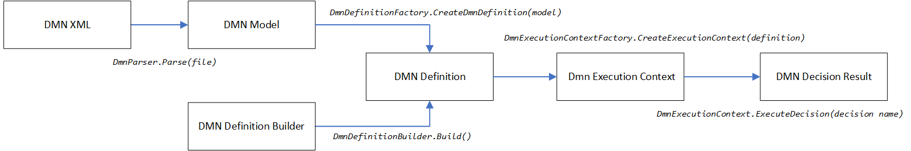

The decision model can be defined in DMN XML defined by OMG (version 1.1 or 1.3). The XML is parsed into `DmnModel` using `DmnParser.Parse`, `DmnParser.Parse13`, `DmnParser.Parse13ext`, `DmnParser.ParseString`, `DmnParser.ParseString13` or `DmnParser.ParseString13ext` methods.

*Note: When parsing with version 1.3ext (`DmnVersion.DmnVersionEnum.V1_3ext`), it still uses the DMN XML 1.3 but with a bit different logic of mapping the XML attributes to definition (details provided later in the document).*

The DMN Model is to be further transferred to `DmnDefinition` using `DmnDefinitionFactory.CreateDmnDefinition`.
The alternative way of creating the DMN Definition is to use the `DmnDefinitionBuilder`. The builder provides fluent methods to prepare the definition and built it at the end using `DmnDefinitionBuilder.Build` method.

Once the DMN Definition is ready, it's to be provided to `DmnExecutionContextFactory.CreateExecutionContext` method to create the DMN execution context. (the `DmnExecutionContext` can be also created directly from `DmnModel` using the `DmnExecutionContextFactory.CreateExecutionContext` overload).

Provide the execution context with input parameters using `WithInputParameter` or `WithInputParameters` methods of context and call `DmnContext.ExecuteDecision` method to get the `DmnDecisionResult`.

*Note: The DMN definition is designed to be "virtually immutable" once created allowing the execution context (execution engine) to reference the definition and its parts without a need to take into a consideration the potential changes in the definition. The meaning of "virtually immutable" is that for sake of simplicity, sometimes the immutability is achieved just by using the read only interface (for example `IReadOnlyDictionary` hiding some of the methods of `Dictionary` or `IDmnVariable` hiding the methods of `DmnVariableDefinition`).*

### Build ###
The library uses the customized MS Build process in projects `build` and `build.tasks`. It's safe to remove such projects from solution if needed.
Details about the build process are described in [build documentation](build/readme.md).

### Tests ###
Tests are implemented using [MS Test Framework](https://github.com/microsoft/testfx) and provide also bunch of sample models that can help together with the test code to better understand how the DMN Engine works and is to be used. 

Note: adjust the `LogHome` variable in `nlog.config` of test project as you need.

The test code is in shared code project that is "linked" to test projects targeting different platforms (.net core 3.1, 5, 6; .net framework 4.6.2, 4.7.2).
`DmnTestBase` class provides abstraction allowing to simply apply the same tests using the different sources (DMN XML 1.1/1.3/1.3ext or builders). 

The "primary" test class inherits from `DmnTestBase` and contains the test code and is set to test against DMN XML 1.1.

The test classes for DMN 1.3 inherits from "primary" test class and override the `Source` property to use the DMN 1.3, the tests themselves are just inherited, so no need to code them again. Same approach is used for tests with parser version 1.3ext.

The builder based definition tests are prepared similar way - inherit from "primary" test class and set the `Source` to used the builders. `DmnBuilderSamples` class is generated from DMN XML files to provide the same decision model (DMN definition) but using the builders (Note: it might be useful to check this class to have a quick look how the builders work).

*Note: I use the test cases also to demonstrate some edge-case or less intuitive behavior, so they can be used also as a study material (tried to explain it in comments in test if needed).*


### Code Documentation ###
The [code documentation](doc/net.adamec.lib.common.dmn.engine.md) is generated during the customized build using [MarkupDoc](https://github.com/adamecr/MarkupDoc).


## DMN Decision Model ##
The DMN Model is actually set of inputs (parameters) and decisions.

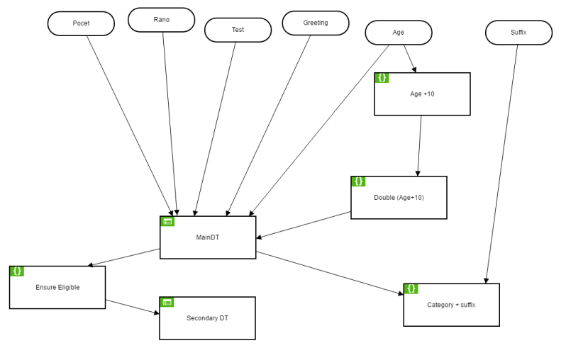

The DMN Model XML is parsed (deserialized) using the `DmnParser.Parse` method getting the `fileName` as input parameter and returning the `DmnModel` (deserialized XML) based on such decisions model XML definition. The DmnParser contains a very simple logic only, as its intention is just to deserialize the XML.
```csharp
model = DmnParser.Parse(fileName);
```

The XML model definition can also be provided as a `string` to `DmnParser.ParseString` method
```csharp
model = DmnParser.ParseString("xml string");
```
`DmnParser` uses the DMN XML v 1.1 by default. It can be overridden using the optional parameter `dmnVersion` when calling the parser. It can contain value `V1_1`(default, supporting DMN XML version 1.3), `V1_3` or 'V1_3ext(to support DMN XML version 1.3). The values are defined in `DmnVersionEnum`. Alternative way of using the DMN version 1.3 is to call methods `DmnParser.Parse13(fileName)`, `DmnParser.ParseString13("xml string")`, `DmnParser.Parse13ext(fileName)` or `DmnParser.ParseString13ext("xml string")`.  

The `DmnModel` needs to be transformed to the `DmnDefinition` using the `DmnDefinitionFactory` that gets the DMN Model and executes "second level parsing" to prepare the DMN Model for the Engine. The most of the "parsing" and validation logic is here. `DmnDefinition` is then used to create the `DmnExecutionContext` allowing the execution/evaluation of the decisions based on the parameters provided.

```csharp
var model=DmnParser.Parse(file);
var definition= DmnDefinitionFactory.CreateDmnDefinition(model);
var ctx = DmnExecutionContextFactory.CreateExecutionContext(definition);
```

Since DMN Engine v1.1.0, the version provided to parser defines not only the version of DMN XML, but has also impact to the mapping logic between the XML attributes and elements to DMN definition. As the mapping logic is implemented in `DmnDefinitionFactory`, the output of `DmnParser` (`DmnModel` class) contains the property `DmnParser.DmnVersionEnum DmnVersion` containing the used/required version. For the sake of simplicity, it's referred as ***parser version*** further in the document when documenting the differences or specifics of particular versions. *Note: when referring to the version of the library, the term "**engine version**" is used.*

The `DmnModel` can be transformed directly to the `DmnExecutionContext` using the `DmnExecutionContextFactory` overload that gets the DMN Model and encapsulates Model-to-Definition transformation.

```csharp
var ctx = DmnExecutionContextFactory.CreateExecutionContext(DmnParser.Parse(file));
```

### DMN Decision Model Builder ###
In some cases, it might be easier to define the decision model directly in the code, for example for simple "static" decision model definitions or in cases when the decision model definition needs to be created dynamically. In such cases, the `DmnDefinitionBuilder` takes place. It provides fluent interface methods to prepare the definition (see details in individual chapters later in this document) and the final method `Build` that will build the definition of the builder for the use in the execution context.

```csharp
var definition = new DmnDefinitionBuilder()
                 ....
                .Build();
var ctx = DmnExecutionContextFactory.CreateExecutionContext(definition);
```

### Inputs ###
 Input represents an external data entering the Engine while evaluating the decision. You can think about it as it's the parameter of the decision to be made.

The input is defined in XML file using the `inputData` element and recognized by its unique `Name` taken from `name` attribute (or from `id` attribute when the `name` attribute is missing. The `id` attribute is mandatory). 

```xml
<definitions>
  <inputData id="InputData_1upwrsh" name="Age" />
</definitions>
```
The parser creates the variable used in the Engine context allowing the Engine to access the input parameter. The variable is created with flag `IsInputParameter`, meaning that the Engine will not allow writing the values into such variable (inputs are immutable). The variable names are being normalized (see later), so it's necessary to keep it in into the consideration when designing the decisions (normalized name needs to be used there). Besides the `Name` as the unique identifier of input (variable), the non-normalized name as taken from XML is stored in `Label` property for the information.

The input (parameter) is to be set to the Engine context before evaluating the decision. If not set, its value will be `null`, which might be OK in case the model takes this into the consideration.
*Note: The value type variables without value are translated to default value, so for example `int` variable will not be `null` but will be set to `0` when the first expression is evaluated (even if the variable is not used in there!).*    
```csharp
ctx.WithInputParameter("input name", inputValue);
``` 
*Note: Inputs by default don't define the data type. The parser tries to recognize the type when "back-tracking" the dependency tree from Decision Table inputs that can define the data type.*

When using the builder, it provides several overloads of `WithInput` method allowing to define the inputs that can be used in the decisions. The overloads with `label` parameter are also available.

```csharp
var def = new DmnDefinitionBuilder()
  .WithInput<int>("input1")
  .WithInput<int>("input2", out var inputVariable2Ref)
  .WithInput("input2", typeof(string))
  .WithInput("input4", typeof(string), out var inputVariable4Ref)
  .WithInputs<string>("input5", "input6")
   ...
  .Build();
```

Although the builder also allows to create the input without specifying the variable type (as in XML), it's recommended to always use the typed inputs within the builders to prevent some potentially unexpected behavior during the execution.


### Decisions ###
 Decision represents an entity the Engine can evaluate and provide the required output(s).

The decision is defined in XML file using the `decision` element and recognized by its unique `Name` taken from `name` attribute (or from `id` attribute when the `name` attribute is missing. The `id` attribute is mandatory). The `Label` for decision is the same as `Name` when parsing from XML.

```xml
<definitions>
  <decision id="mainDt" name="MainDT">
  </decision>
</definitions>

```


The `Name` of the decision is used to execute its evaluation
```csharp
result = ctx.ExecuteDecision("decision name");
```
The Engine supports the following decision types
-  Expression Decisions that evaluate the defined expression and output the result into defined output variable
-  Decision Tables that evaluate set of decision rules and provide matching output(s) 

The builder provides two methods `WithExpressionDecision` and `WithTableDecision` to define the decisions. We will get to the details in the chapters related to expression decisions and decision tables. Optional label can be defined using the overloads.

```csharp
var definition = new DmnDefinitionBuilder()
  .WithInput<int>("input1")
  .WithVariable<bool>("variable1", out var variable1)
  .WithVariable<string>("variable2", out var variable2)
  .WithExpressionDecision("exprDecision", "input1>3", variable1)
  .WithTableDecision("tableDecision", table=>
    table
      .WithInput(variable1,out var tblInputRef)
      .WithOutput(variable2,out var tblOutputRef)
      .WithRule("rule 1",r=>r
         .When(tblInputRef,"true")
         .Then(tblOutputRef,@"""T"""))
      .WithRule("rule 2", r=>r
         .Always()
         .Then(tblOutputRef,@"""F""")))
  .Build();
```

#### Dependency Tree ####
When the model is parsed, the parser builds the dependency tree based on the information requirement connector. The decision can depend on zero or more inputs and on zero or more other decisions. When parsing the decision, the parser creates the full dependency tree of required decisions that need to be evaluated before (in proper order).


Required inputs actually don't define the "hard dependency", meaning they are not checked during the execution for the existence of value (not being null). Definition of the required inputs is rather to describe the connection between the input and the decision for the information or better understanding of the whole decision model

The dependency is stored in XML within the `informationRequirement` element that can be `requiredInput` or `requiredDecision`. Both types must have the `href` attribute referencing the proper input or decision by their id (with "#" prefix). 
*Note: Exactly one of the sub elements (`requiredDecision` or `requiredInput`) must be present within the `informationRequirement` element.*
```xml
<decision id="mainDt" name="MainDT">
    <informationRequirement>
      <requiredDecision href="#doubleAge" />
    </informationRequirement>
    <informationRequirement>
      <requiredInput href="#InputData_1" />
    </informationRequirement>
</decision>

<decision id="doubleAge" name="Double (Age+10)">
</decision>
<inputData id="InputData_1" name="Age">
</inputData>
```
In the Engine version <1.1, the `DmnDefinitionFactory` did the recursive check through required decision when processing the required inputs for a particular decision in XML. The generated decision definition contained not only directly required inputs but also all inputs required by the decisions in the dependency tree. **This behavior has been changed in version 1.1** (and above), when the `DmnDecision.RequiredInputs` contains only the directly required inputs - the same way as in XML. 

*Note: This applies only when parsing the DMN from XML, the builders didn't implement the recursive check even in early versions.*


Builders for decisions provide two overloads of `Require` method allowing to define the required input(s) and/or decision(s).

```csharp
var def = new DmnDefinitionBuilder()
  .WithInput<int>("input1", out var input1Ref)
  .WithInput<int>("input2", out var input2Ref)
  .WithVariable<bool>("variable1", out var variable1Ref)
  .WithVariable<bool>("variable2", out var variable2Ref)
  .WithExpressionDecision("eDecision1", "input1>3",variable1Ref,out var eDecision1Ref)
  .WithExpressionDecision("eDecision2", eDecision =>
    eDecision
      .Put("variable1 && input2=='ahoy'").To(variable2Ref)
      .Requires(input2Ref)
      .Requires(eDecision1Ref),out var eDecision2Ref)
  .WithTableDecision("tDecision1", table=>
    table
      .WithInput(input1Ref,out var tableInput1Ref)
      .WithInput(variable2Ref,out var tableInput2Ref)
      .WithOutput(variable2Ref,out var tableOutput)
      .WithRule("Rule1",r=>r.When(tableInput1Ref, ">6").And(tableInput2Ref,"true").Then(tableOutput,"ABC"))
      .WithRule("Rule2", r => r.Always().Then(tableOutput, "DEF"))
      .Requires(input1Ref)
      .Requires(eDecision2Ref))
  .Build();
```
Besides the `RequiredInputs` and `RequiredDecisions`, the `DmnDecision` provides methods `GetAllRequiredInputs()` and `GetAllRequiredDecisions()` that collect the information through the whole dependency tree (regardless whether the XML parser or builder has been used to create the definition).


The decision is executed and evaluated by Engine using the method `ctx.ExecuteDecision`.
```csharp
result = ctx.ExecuteDecision("decision name");
```
The Engine checks for the decision dependencies and when any decision needs to be evaluated before (required decision), the Engine evaluates such decision. This is done recursively, so the complex dependencies can be defined.

**Important: As mentioned above, the dependency check is simple recursion with no "cache-and-skip-next-time". Meaning that when the full dependency chain is always backtracked and executed and a single decision can be executed multiple times if multiple decisions defines it as a dependency. Keep this in mind when specifying the decision dependencies - it's not "just for information", but it means the decision will be executed.**

*Note: The Engine doesn't check for the circular dependencies, so the execution of model will fail with `StackOverflowException` in such cases.*

## Variables in Decision Model ##
As mentioned above, the inputs are one kind of variables existing in the Engine context. The variables allow sharing the data between the model elements. When the decision is evaluated, it gets some information at the input and produces the outputs. The outputs are also stored into the variables, so they can be used as inputs for another decisions.

The Engine uses the [Dynamic Expresso](https://github.com/davideicardi/DynamicExpresso) interpreter and the full set of variables is provided to the interpreter while evaluating any of the expressions within the Engine, so they can be recognized in expressions. *Note: Technically, the variables are provided as parameters, so it's possible to parse the expression once and invoke it with the real values when needed - DMN Engine implements the parsed expressions cache.*

```csharp
var parameters = new List<Parameter>();
foreach (var variable in Variables.Values)
{
	//check null variable for value type
	var varValue = variable.Value ?? variable.Type?.GetDefaultValue();

	var parameter = new Parameter(variable.Name, variable.Type ?? varValue?.GetType() ?? typeof(object), varValue);
	parameters.Add(parameter);
}

parsedExpression = interpreter.Parse(expression, outputType, parameters.ToArray());
var result = parsedExpression.Invoke(parameters.ToArray());
}
```

The Engine context keeps the list of variables as triplets:
- `Name` - name of the variable that is used as a reference as well as the name of the variable for the expression interpreter. 
- `Type` - the variable values are stored within the Engine context as `object`, however, it provides some support for the data types. It's possible to define the data type in some parts of model - output variable for the expression decision, inputs and outputs for decision tables. The XML parser sets the type of variable at the first place where known and then checks that the data type is the same if set somwhere else. The definition builder for variable requires the type to be specified. When the variable value is set during the execution and the type is known, the Engine tries to cast (`Convert.ChangeType(value, Type)`) the value to required type. 
- `Value` - current value of the variable. When provided to the expression interpreter, the value type (non-nullable) variables are set to default value of the value type when the current value stored within the context is null

When using the DMN XML, the variables are defined during the processing the XML based on:
 - Decision model inputs
 - Output variables for expression decisions
 - Inputs of decision tables bound to variable
 - Outputs variables for decision tables 

When using the builders, the variables must be explicitly defined. When the variable is to be used in builder, get the variable reference from the variable builder and use it in other builders.

```csharp
var def = new DmnDefinitionBuilder()
  .WithVariable<bool>("variable1", out var variable1Ref)
  .WithVariable("variable2",typeof(string), out var variable2Ref)
  .Build();
```

*Note: The expressions are not parsed/analyzed when the definition is being prepared, so there is no kind of detection/validation of the variables within the expressions*

### Variable Names ###
The names of the variables can contain the letters (`char.IsLetter()`), digits (`char.IsDigit()`) and underscore (`_`). The first character must be a letter. 

As it's quite common (although not recommended) to use the space in the variable names, the variable names are "normalized" - the trailing spaces are removed and the inner spaces are replaced by underscore (`name.Trim().Replace(' ', '_')`). Also the characters `?#$%&*()` are being removed from the name during the normalization. This is to keep the variable name "compact" when used in expressions (either implicit ones used when evaluating the decision table rules or explicit ones defined in the DMN definition). This is important to be kept in mind when designing the definition - for example when there will be a variable `Some Variable_1  with spaces ? `, it must be referred as `Some_Variable_1__with_spaces` within the expressions. The normalization might also cause the unintentional duplicity if not taken into the consideration - for example variables `A B` and `A_B` will be duplicates as the first one will be normalized to `A_B`.

As the input names are used for backing variables, the above mentioned applies for the DMN input names as well.

### Data Types for Variables ###
When the data type is defined in DMN model (attribute `typeRef`), the parser maps the types to the .NET types using the logic below
```csharp
...
   typeName = typeName.ToLower();
   switch (typeName)
   {
     case "string": return typeof(string);
     case "boolean": return typeof(bool);
     case "integer": return typeof(int);
     case "long": return typeof(long);
     case "double": return typeof(double);
     case "date": return typeof(DateTime);
     default: throw Logger.Fatal<DmnParserException>( $"Unsupported type name {typeName}");
   }
...
```
Besides the defined data types (also referred as "known types"), the Engine actually supports any .NET type known while evaluating the expressions, it's just not possible to explicitly define such data type for the variables in DMN Model.
For example, let's have following model

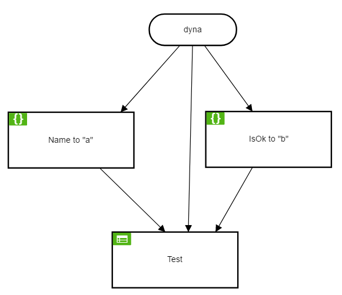

Input parameter `dyna` is complex object
```csharp
var dyna = new { Name = "name", IsOk = true, Direct="some value" };
ctx.WithInputParameter("dyna", dyna);
```
It can be simply used in expression decision, however the output is mapped to variable of "standard" type
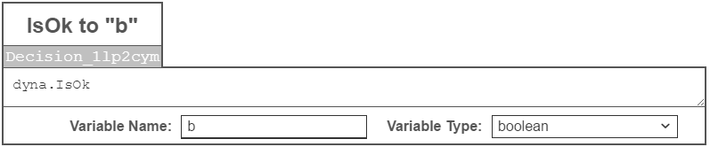

When used in decision tables, the complex objects can be used as inputs as well as in rules for input/output expressions. Once again, the output is mapped to variable of "standard" type. The XML syntax is described below at Decision Tables chapter.
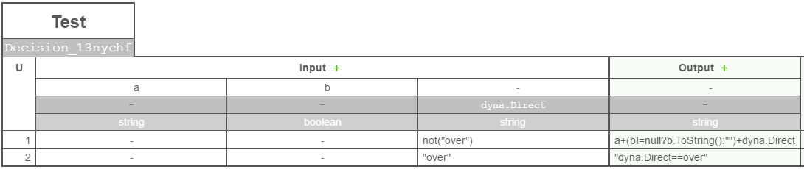

## Expressions in Decision Model ##
As mentioned above, the Engine uses the [Dynamic Expresso](https://github.com/davideicardi/DynamicExpresso) interpreter, so the expression syntax must comply with the interpreter, on the other side, it brings quite a flexibility into the rule definition.
- All Engine context variables are provided to the interpreter (see above)
- The expressions in Expression decisions are evaluated and assigned to the output variable
- The expressions in Decision tables input parameter definitions are evaluated to get the "left side" of rule comparison (each input/column within the rule is evaluated separately)
- The expressions in Decision table rule inputs are evaluated as the "operator and the right side" of rule comparison.
- The expressions in Decision table rule outputs are evaluated and assigned to the output variable

S-FEEL expressions subset is supported for Decision table rule input conditions. S-FEEL expressions are translated to expressions using `SfeelParser`.
- `not(expression)` - negates the condition. The `expression` can be S-FEEL expression as well
- list of values (`expr1,expr2,exprN`) - the `expr` can be number constant, string constant (in quotation marks), variable name
- simple comparators - `<`,`>`,`<=`,`>=`
- ranges - `[from..to]`. `[..]` means inclusive, `(..)` or `]..[` is exclusive. Start and end inclusive/exclusive markers can be different - for example `(..]`

Some of the S-FEEL functions are injected to Dynamic Expresso interpreter as custom functions, so they can be used within the expression:
- `date` - returns the `DateTime` from `string` in format `yyyy-MM-dd`
- `date and time` - returns the `DateTime` from `string` in format `yyyy-MM-ddTHH:mm:sszzzzzz`, `yyyy-MM-ddTHH:mm:ss`, `yyyy-MM-ddTHH:mm`. As the function name contains spaces, it's internally translated to `date_and_time`
- `time` - returns the `DateTime` from `string` in format `HH:mm:sszzzzzz`, `HH:mm:ss`, `HH:mm`. The date part is current date.
- `duration` - returns the `TimeSpan` from `string` in [ISO 8601 duration format](https://en.wikipedia.org/wiki/ISO_8601#Durations)

## Expression Decisions ##
Expression decision evaluates the expression and stores the returned value in output variable.


The expression is in `text` element of the `literalExpression` child of the `decision` element in DMN XML.
The output variable is identified by `name` (or `id` if `name` is missing) attribute. The data type is defined in `typeRef` attribute and is used to specify/cross-check the variable data type (casting is not supported).
  
```xml
  <decision id="D1" name="IsOk">
    <variable id="var1" name="b" typeRef="boolean" />
    <informationRequirement>
      <requiredInput href="#InputData1" />
    </informationRequirement>
    <literalExpression id="expr1">
      <text>dyna.IsOk</text>
    </literalExpression>
  </decision>
```

The builder provides several overloads of method `WithExpressionDecision` allowing to define the expression decision. The simplest one is just to define the decision name, expression and the reference to the output variable. It's also possible to get the reference to the expression decision using the other overload.
The more complex way is using the expression decision builder with methods `Put` for the definition of the expression and `To` to define the output variable. This allows using the `Required` methods when needed. This way also have an overload with the output of the reference to the expression decision defined.

```csharp
var expressionDecisionDefinition1 = new DmnDefinitionBuilder()
  .WithInput<int>("input1")
  .WithVariable<bool>("outputVariableE1", out var outputVariableE1)
  .WithExpressionDecision("eDecision1", "input1>3", outputVariableE1)
  .Build();

var expressionDecisionDefinition2 = new DmnDefinitionBuilder()
  .WithInput<int>("input1")
  .WithVariable<bool>("outputVariableE2", out var outputVariableE2)
  .WithExpressionDecision("eDecision2", "input1>3", outputVariableE2, out var eDecision2)
  .Build();

var expressionDecisionDefinition3 = new DmnDefinitionBuilder()
  .WithInput<int>("input1", out var input1Variable)
  .WithVariable<bool>("outputVariableE3", out var outputVariableE3)
  .WithExpressionDecision("eDecision3",
     eDecision => eDecision.Put("input1>3").To(outputVariableE3))
  .Build();

var expressionDecisionDefinition4 = new DmnDefinitionBuilder()
  .WithInput<int>("input1")
  .WithVariable<bool>("outputVariableE4", out var outputVariableE4)
  .WithExpressionDecision("eDecision4",
     eDecision => eDecision.Put("input1>3").To(outputVariableE4),
     out var eDecision4)
  .Build();

var expressionDecisionDefinition5 = new DmnDefinitionBuilder()
  .WithInput<int>("input1", out var input1E5)
  .WithVariable<string>("someVariableE5", out var someVariableE5)
  .WithVariable<bool>("outputVariableE5", out var outputVariableE5)
  .WithExpressionDecision("eDecision5A",
     eDecision => eDecision.Put("input1>3").To(outputVariableE5),
     out var eDecision5A)
  .WithExpressionDecision("eDecision5b", eDecision =>
     eDecision
       .Put("outputVariableE5 && someVariableE5=='ahoy'").To(outputVariableE5)
       .Requires(input1E5)
       .Requires(eDecision5A))
  .Build();
```

## Decision Tables ##
Decision table defines the set of rules - "when the input values matches all input conditions, provide defined outputs".
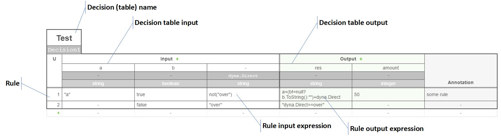
Input and output definitions (declarations) are common for all rules and define the columns used in decision table.
**Decision table input** means that there will be an input data of given type that are to be evaluated using the rule input expression. Decision table input also defines, where to get the input data - from variable (variable input) or by evaluating the expression (expression input). 
*Note:The expression input expressions are evaluated for each rule.*
There are three table inputs in the example above:
- Variable input mapped to variable `a` of type `string`
- Variable input mapped to variable `b` of type `boolean` (`bool`)
- Expression input with expression `dyna.Direct` evaluated to `string`.

**Decision table output** means that Engine will provide the output for rules with positive match and store them into defined variables with given type.
There are two table outputs in the example above:
- Output mapped to variable `res` of type `string`
- Output mapped to variable `amount` of type `integer`

*Note: The mapping to the variables (persistence) is done after all rules are evaluated and the single or multiple rules with positive match are selected by Hit policy. Although it's possible to manipulate the output mapped variables within the rule expression, it's strongly recommended not to do so.* 

**Rule** is the set of input and output expressions.
The **Rule input expression** defines kind of condition that the input data must meet to make the rule the positive match. It's possible to omit the rule input expression, meaning that the related table input will not be evaluated for such rule.
There will be following conditions used when evaluating the decision table above

- Rule 1 - will be evaluated as positive, if all following conditions are valid (true)
  - `a=="a"` - value of string variable `a` is constant `a`.
  - `b==true` - value of bool variable `b` is `true`
  - `!(dyna.Direct=="over")` - result of expression `dyna.Direct` is not the constant `over`
- Rule 2 - will be evaluated as positive, if all following conditions are valid (true)
  - `b==false` - value of bool variable `b` is `false`
  - `dyna.Direct=="over"` - result of expression `dyna.Direct` is the constant `over`

Actually, it's possible to omit all input expressions, so the rule will be always evaluated as positive match. 
 
The **Rule output expression** defines the data that the Engine will store to defined output variables (and return). It's always handled as the expression even if returning the constant.
There are following outputs for the rules of the decision table above

- Rule 1 - will produce following outputs
  - `a+(b!=null?b.ToString():"")+dyna.Direct` - concatenated string of value of variable `a`, value of variable `b` and value of `Direct` property of object (variable) `dyna`. This concatenated string will be stored to variable `res`.
  - `50` - integer constant `50` will be store to variable `amount`.
- Rule 2 - will produce following output
  - `"dyna.Direct==over"` - string constant `dyna.Direct==over` will be stored to variable `res`.
  
It's possible to omit one or more (all) output expressions. In this case the Engine will just not produce the output value (so the output variable will NOT be "cleaned" or set to `null`).

### Inputs in XML ###
There is a **significant change in the parser version 1_3ext** (and above for future) **and parser version 1_3** (and 1_1) **how the XML elements and attributes are mapped to variables and expressions**. The logic is described in detail in following sub-chapters. As the difference between the parser logic is quite significant, the single XML file will the most probably provide different mappings with each parser, so **keep the parser version in mind, when design the DMN XML model**.

Besides the mapping of table input to the variable or expression described in following chapters, there is also a `Label` of table input (used for information only, labels are not used at all during the execution).
 - When the `label` attribute of input is set, the `Label` is taken from there
 - Otherwise, when the input is mapped to a variable, the `Label` is set from the "source" of the variable name (without normalization)
 - Otherwise the default label `Input#n` is used where `n` is the order of input (1-based)


#### Parser version 1_3ext (and above) ####
There can be different ways how the table inputs are defined in the XML definition
```xml    
<decisionTable> 
  <input id="InputClause1" label="a" camunda:inputVariable="a">
    <inputExpression id="e1" typeRef="string" />
  </input>

  <input id="InputClause2" label="">
    <inputExpression id="e2" typeRef="string">
      <text>a</text>
    </inputExpression>
  </input>
  <input id="InputClause3" label="">
    <inputExpression id="e3" typeRef="string">
      <text>dyna.Direct</text>
    </inputExpression>
  </input>

  <input id="InputClause4" label="b">
    <inputExpression id="e4" typeRef="boolean" />
  </input>
  <input id="InputClause5" label="b*2">
    <inputExpression id="e5" typeRef="integer" />
  </input>

  <input id="a" label="">
    <inputExpression id="e6" typeRef="string" />
  </input>
  
</decisionTable>
```
The mapping and processing logic is following:
 - When there is an attribute `camunda:inputVariable`, the table input takes the value from variable. When such variable doesn't exist, the exception is thrown
 - Otherwise, when the expression text is defined
   - When the expression text after normalization corresponds with an existing variable, the table input takes the value from such variable
   - Otherwise, the table input is evaluated using the expression as defined in expression text
 - Otherwise, when the `label` attribute is defined
   - When the `label` after normalization corresponds with an existing variable, the table input takes the value from such variable
   - Otherwise, the table input is evaluated using the expression as defined `label` attribute
 - Otherwise, when the `id` attribute after normalization corresponds with an existing variable, the table input takes the value from such variable
 - Otherwise the parser exception is thrown.


When the mapping leads to a variable, the data type defined in `typeRef` attribute of `inputExpression` element is used to specify/cross-check the variable data type (casting is not supported). Type specified in `typeRef` is ignored (not used at all) for the expression inputs.

#### Parser version 1_3 and 1_1 ####
Let's have following inputs in the XML definition
```xml    
<decisionTable>
  <input id="InputClause1" label="a">
    <inputExpression id="e1" typeRef="string" />
  </input>
  <input id="InputClause2" label="b">
    <inputExpression id="e2" typeRef="boolean" />
  </input>
  <input id="InputClause3" label="">
    <inputExpression id="e3" typeRef="string">
      <text>dyna.Direct</text>
    </inputExpression>
  </input>
</decisionTable>
```

If there is no value in `text` element of the `inputExpression`, the table input is *variable input* mapped to the variable with name defined in `label` attribute of `input` element. If the `label` attribute is missing, the `id` attribute will be used instead to get the name of the input variable. The data type defined in `typeRef` attribute is used to specify/cross-check the variable data type (casting is not supported)

Whenever the `text` element of the `inputExpression` is not empty, the table input is *expression input* and the expression within the `text` element will be evaluated as described above. Type specified in `typeRef` is ignored (not used at all) for the expression inputs.

### Inputs in Builder ###
`TableDecision` builder provides methods `WithInput` for table input definition. The input can be either directly bound to the model variable/input (*variable input*) or the expression can be used to get the input value  (*expression input*)

```csharp
var definition = new DmnDefinitionBuilder()
  .WithInput<int>("modelInput1", out var modelInput1Ref)
  .WithVariable<string>("variable1", out var variable1Ref)
  .WithTableDecision("tableDecision", table =>
    table
      .WithInput(modelInput1Ref, out var tableInput1)
      .WithInput(variable1Ref, out var tableInput2, "a", "b")
      .WithInput(@"modelInput1.ToString()+""<""", out var tableInput3)
      .WithInput("variable1.ToString()[0]", out var tableInput4, "1", "2", "3", "4")
      .WithOutput(variable1Ref,out var tableOutputRef)
      .WithRule("rule1", r => r
         .When(tableInput1, "(2..5[")
         .Then(tableOutputRef, "it's 2 to 5"))
    )
  .Build();
```

### Outputs in XML ###
There is also a **change in the parser version 1_3ext** (and above for future) **and parser version 1_3** (and 1_1) **how the XML attributes are mapped to variable name**,so **keep the parser version in mind, when design the DMN XML model**.

```xml  
<decisionTable>
  <output id="output_1" label="res" name="var" typeRef="string" />
  <output id="output_2" label="res" name="" typeRef="string" />
  <output id="output_3" label="amount" typeRef="integer" />
</decisionTable>
```

The output definition in XML always maps to a variable. It can either be an existing one or a new one that will be created. Data type is defined in `typeRef` attribute and is used to specify/cross-check the variable data type (casting is not supported).

- Parser version 1_3ext (and above): The name of the output variable is taken from the attribute `name` (if set) or from `label` if `name` is missing or from `id` when also `label` is missing.
- Parser version 1_3 and 1_1 : The name of the output variable is taken from the attribute `label` (if set) or from `name` if `label` is missing or from `id` when also `name` is missing. 

Besides the mapping of table output to the variable also a `Label` of table output (used for information only, labels are not used at all during the execution).
 - When the `label` attribute of output is set, the `Label` is taken from there
 - Otherwise, when the `name` attribute of output is set, the `Label` is taken from there
 - Otherwise the default label `Output#n` is used where `n` is the order of output (1-based)


### Outputs in Builder ###
`TableDecision` builder provides method `WithOutput` for table output definition. It takes a reference to the output variable and provided the reference to the table output to be used in rules. Allowed values (see later in this document) can be provided when needed.

```csharp
var definition = new DmnDefinitionBuilder()
  .WithInput<int>("modelInput1", out var modelInput1Ref)
  .WithVariable<int>("variable1", out var variable1Ref)
  .WithVariable<bool>("variable2", out var variable2Ref)
  .WithTableDecision("tableDecision", table =>
     table
       .WithInput(modelInput1Ref, out var tableInput1)
       .WithOutput(variable1Ref, out var tableOutput1Ref,"1","2","3")
       .WithOutput(variable2Ref, out var tableOutput2Ref)
       .WithRule("t1Rule1", r => r
          .When(tableInput1, "(2..5[")
          .Then(tableOutput1Ref, "1")
          .And(tableOutput2Ref,"true"))
     )
  .Build();
```

### Rules in XML ###
The decision table in the example above will have following rules in the XML definition
```xml  
<decisionTable>
  <rule id="row1">
    <description>some rule</description>

    <inputEntry id="id1">
      <text><![CDATA["a"]]></text>
    </inputEntry>
    <inputEntry id="id2">
      <text>true</text>
    </inputEntry>
    <inputEntry id="id3">
      <text><![CDATA[not("over")]]></text>
    </inputEntry>
    
    <outputEntry id="id4">
      <text><![CDATA[a+(b!=null?b.ToString():"")+dyna.Direct]]></text>
    </outputEntry>
    <outputEntry id="id5">
      <text>50</text>
    </outputEntry>
  </rule>

  <rule id="row2">
    <inputEntry id="id6">
      <text></text>
    </inputEntry>
    <inputEntry id="id7">
      <text>false</text>
    </inputEntry>
    <inputEntry id="id8">
      <text><![CDATA["over"]]></text>
    </inputEntry>
  
    <outputEntry id="id9">
      <text><![CDATA["dyna.Direct==over"]]></text>
    </outputEntry>
    <outputEntry id="id10">
      <text></text>
    </outputEntry>
  </rule>
</decisionTable>
```
The rule input expressions are defined using the `inputEntry` elements. **Their count and order must match the table input definitions** (there is no other way of pairing). The `text` sub-element of `inputEntry` defines the rule input expression. If the `text` element is empty or contains constant `-` (dash) the input will be omitted in rule evaluation.

The rule output expressions are defined using the `outputEntry` elements. **Their count and order must match the table output definitions** (there is no other way of pairing). The `text` sub-element of `outputEntry` defines the rule output expression. If the `text` element is empty or contains constant `-` (dash) the output will be omitted (not produced) during the decision table evaluation.

The optional rule annotation is stored in element `description`. 

### Rules in Builder ###
`TableDecision` builder provides method `WithRule` for table rule definition. It takes a mandatory table-unique rule name and optional description and provides the rule builder to define the input conditions and output calculations.

The input condition is defined as a pair of table input reference and the rule input expression. The first condition (doesn't need to be related to the first input) is defined using `When` method and additional ones can be added using `And` method(s). Use `Always` to skip the rule input definition (rule will be always evaluated as positive hit).

The output calculation is defined as a pair of table output reference and the rule output expression. The first output calc expression (doesn't need to be related to the output input) is defined using `Then` method and additional ones can be added using `And` method(s). Use `SkipOutput` to skip the rule output definition (rule will produce no output).

Although the builder chains for the rule input and output expression guides use quite intuitive way, for the advanced scenarios, it's good to know that:
 - `When` and `Then` will clear all input or output expressions first and if the expression parameter is not null or whitespace, it will add it as the expression for the given rule input/output
 - `Add` will set the input or output expression for given input/output if the expression is not null or whitespace. Otherwise, the expression for given input/output is removed. Other inputs/outputs are kept untouched
 - `Always` and `SkipOutput` will clear all input or output expressions for the rule.

Some examples:

```csharp
var definition = new DmnDefinitionBuilder()
  .WithInput<int>("input1", out var inputVar1Ref)
  .WithInput<bool>("input2", out var inputVar2Ref)
  .WithVariable<string>("output1", out var outputVar1Ref)
  .WithVariable<int>("output2", out var outputVar2Ref)
  .WithVariable<bool>("output3", out var outputVar3Ref)
  .WithTableDecision("tDecision1", table =>
     table
       .WithInput(inputVar1Ref, out var tableInput1Ref)
       .WithInput(inputVar2Ref, out var tableInput2Ref)
       .WithInput("input2.ToString()[0]", out var tableInput3Ref)
       .WithOutput(outputVar1Ref, out var tableOutput1Ref)
       .WithOutput(outputVar2Ref, out var tableOutput2Ref)
       .WithOutput(outputVar3Ref, out var tableOutput3Ref)
       
       .WithRule("rule1", r => r
          .When(tableInput1Ref, "1")
          .Then(tableOutput1Ref, "\"a\""))
       .WithRule("rule2", r => r
          .When(tableInput1Ref, "11")
          .And(tableInput2Ref, "false")
          .Then(tableOutput2Ref, "111"))
       .WithRule("rule3", r => r
          .When(tableInput1Ref, "2")
          .And(tableInput2Ref, "true")
          .Then(tableOutput2Ref, "2")
          .And(tableOutput1Ref, "\"b\"")
          .And(tableOutput3Ref, "false"))
       .WithRule("rule4", "some rule description", r => r
          .When(tableInput1Ref, "33")
          .And(tableInput2Ref, "false")
          .And(tableInput3Ref, "\"t\"")
          .Then(tableOutput1Ref, "\"three\""))
       .WithRule("rule5", r => r
          .When(tableInput1Ref, "4")
          .Then(tableOutput1Ref, "\"four\"")
          .And(tableOutput2Ref, "4")
          .And(tableOutput3Ref, "true"))
       .WithRule("rule5", r => r
          .Always()
          .Then(tableOutput3Ref, "false"))
       .WithRule("rule6", r => r
          .Always()
          .Then(tableOutput1Ref, "\"six\"")
          .And(tableOutput2Ref, "66"))
       .WithRule("rule7", r => r
          .Always()
          .Then(tableOutput1Ref, "\"7\"")
          .And(tableOutput3Ref, "true"))
       .WithRule("rule8", r => r
          .When(tableInput2Ref, "false")
          .SkipOutput())
       .WithRule("rule9", r => r
          .When(tableInput1Ref, "9")
          .And(tableInput2Ref, "true")
          .SkipOutput())
       .WithRule("rule10", r => r
          .Always()
          .SkipOutput())
    )
 .Build();
```

#### S-FEEL Expressions Helper ####
The struct `SFeel` is a helper for composing the SFeel input expressions provided to `When` and input `And` methods of the rule builders as an alternative to raw string expressions. It ****helps with the syntax, but don't check for semantics****, so it's still necessary to understand how to compose the valid expressions.

The expressions within helper are built from tokens, operations and functions reflecting the syntax of S-FEEL expressions as described above. The folowing sample demonstrates using the helper in the rule builder instead of providing the expressions as strings:

```csharp
var def = new DmnDefinitionBuilder()
  .WithInput<int>("input1", out var inputVar1Ref)
  .WithInput<int>("input2", out var inputVar2Ref)
  .WithVariable<int>("output", out var outputVarRef)
  .WithTableDecision("tbl", table =>
     table
       .WithInput(inputVar1Ref, out var tblInput1Ref)
       .WithInput(inputVar2Ref, out var tblInput2Ref, l.ToArray())
       .WithOutput(outputVarRef, out var tblOutputRef)

       .WithRule("r1", "input1 > 10 -> input1", r => r
          .When(tblInput1Ref, SFeel.Gt(10))
          .Then(tblOutputRef, "input1"))

       .WithRule("r2", "input1 >=5 && <15, input2 is 1|3|input1 -> input2/2", r => r
          .When(tblInput1Ref, SFeel.RngIE(5,15))
          .And(tblInput2Ref, SFeel.Eq(1,3,inputVar1Ref))
          .Then(tblOutputRef, "input2/2"))

       .WithRule("r3", "input2 !5 && !input1 -> 10", r => r
          .When(tblInput2Ref, SFeel.Not(5,inputVar1Ref))
          .Then(tblOutputRef, "10"))

       .WithHitPolicy(HitPolicyEnum.Collect)
       .WithAggregation(CollectHitPolicyAggregationEnum.List))
  .Build();
```

Single tokens are the constants or variable references - for example `SFeel.Eq("A")` encapsulates a string token `"A"` (quotation marks are the part of the token/expression), `SFeel.Eq(1)` encapsulates the integer token `1` and `SFeel.Eq(varRef)` represents the token for the variable reference (`varRef` is of type `Variable.Ref`) that will render as variable name into the expression. `Eq` is the operation representing equality check and as this is the default one, the `==` is not used in input expressions, so the above mentioned samples will generate expressions `"A"`, `1` and `variableName`. 
It's also possible to provide the token sets within the rule expressions like `1,2,3`, in such case simply use `SFeel.Eq(1,2,3)` or even for combined sets like `2,[5..10],variable1` use `SFeel.Eq(2,SFeel.RngI(5,10),variable1Ref)`. 

The previous sample introduced `RngI(from,to)` function representing range `[from..to]`. Similar way `RngE(from,to)` generates the range excluding the opening and closing values `]from..to[` and functions `RngIE` and `RngEI` generate the ranges `[from..to[` and `]from..to]`.

Besides the "main" operation `Eq`, the helper provides operations `Gt` (greater-than), `Ge` (greater-or-equal), `Lt` (less-than) and `Le` (less-or-equal) for comparison as well as `Not` representing `not()` in expression.

The helper also provide methods (with several overloads) helping with the expression functions `date()`, `date and time()`, `time()` and `duration()`.

See the samples below how to get the expression strings using the helper

```csharp
//"b"
var r1 = SFeel.Eq("b");
//6
var r2 = SFeel.Eq(6);
//"6"
var r3 = SFeel.Eq("6");
//"a","aa","aaa"
var r4 = SFeel.Eq("a", "aa", "aaa");
//6,8,3
var r5 = SFeel.Eq(6, 8, 3);

//< 5
var r6 = SFeel.Lt(5);
//<= 4
var r7 = SFeel.Le(4);
//> 5
var r8 = SFeel.Gt(5);
//>= 7
var r9 = SFeel.Ge(7);

//[2..5]
var r10 = SFeel.Eq(SFeel.RngI(2, 5));
//[2..5[
var r11 = SFeel.Eq(SFeel.RngIE(2, 5));
//]2..5]
var r12 = SFeel.Eq(SFeel.RngEI(2, 5));
//]2..5[
var r13 = SFeel.Eq(SFeel.RngE(2, 5));
            
//not(6)
var r14 = SFeel.Not(6);
//not("b","c","q","o","r","s","v")
var r15 = SFeel.Not("b", "c", "q", "o", "r", "s", "v");
//not(<= 5)
var r16 = SFeel.Not(SFeel.Le(5));
//not(> 4)
var r17 = SFeel.Not(SFeel.Gt(4));
//not([2..5])
var r18 = SFeel.Not(SFeel.RngI(2, 5));
//not(]2..5[)
var r19 = SFeel.Not(SFeel.RngE(2, 5));
           
//4,[6..9[,11
var r20 = SFeel.Eq(4, SFeel.RngIE(6, 9), 11);
//not(4,[6..9[,11)
var r21 = SFeel.Not(4, SFeel.RngIE(6, 9), 11);
           
//< date("2018-01-23")
var r22 = SFeel.Lt(SFeel.Date(new DateTime(2018, 01, 23)));
//not(> date("2018-01-23"))
var r23 = SFeel.Not(SFeel.Gt(SFeel.Date("2018-01-23")));
//not(date("2018-01-23"))
var r24 = SFeel.Not(SFeel.Date(2018, 01, 23));

//>= date and time("2018-01-23T15:30:15")
var r25 = SFeel.Ge(SFeel.DateAndTime(new DateTime(2018, 01, 23,15,30,15)));
//not(<= date and time("2018-01-23T15:30"))
var r26 = SFeel.Not(SFeel.Le(SFeel.DateAndTime(2018, 01, 23, 15, 30)));
//date and time("2018-01-23T15:30")
var r27 = SFeel.Eq(SFeel.DateAndTime("2018-01-23T15:30"));

//time("13:00")
var r28 = SFeel.Eq(SFeel.Time("13:00"));
//< time("13:45")
var r29 = SFeel.Lt(SFeel.Time(13,45));
//not(time("13:10:45"))
var r30 = SFeel.Not(SFeel.Time(new TimeSpan(13,10,45)));

//duration("P3Y")
var r31 = SFeel.Eq(SFeel.Duration("P3Y"));
//duration("P92D")
var dt = new DateTime(2018, 01, 23);
var r32 = SFeel.Eq(SFeel.Duration((dt.AddMonths(3).AddDays(2))-dt));
//duration("P5DT6H7M")
var r33 = SFeel.Eq(SFeel.Duration(5,6,7));
//duration("-P6M7DT9M10S")
var r34 = SFeel.Eq(SFeel.Duration(0, 6, 7,0,9,10,true));
            
//>= (date("2018-01-23") + duration("P3Y"))
var r35 = SFeel.Ge(SFeel.Expr($"({SFeel.Date(2018, 01, 23)} + {SFeel.Duration(3, 0, 0,0,0)})"));
```


### Allowed Values Constraints ###
It's possible to define the constraints for input a/or output values. When the input defines the constraint, it first gets the variable value as string for the variable inputs or evaluates the input expression and converts the result to string for the expression inputs. Then it's checked against the list of allowed values for the input. When the input value is not compliant with the constraint, the rule is marked as no-match and the processing continue with the next rule. When the values check is ok (or there is no constraint), the rule is evaluated "standard way"

***This is the breaking change in version 1. In versions <1, the input not matching the constraint could throw the execution exception. I decided to change the logic, as per DMN standard, the intention of allowed input values is more to be another condition (satisfactory criteria) rather than the hard input validation. Also the logic when the exception was thrown was not quite consistent and intuitive.***

The output allowed values are checked when processing the rules with positive hit (for each positive hit rule and for each output). The output result is calculated by evaluating the output expression (that's the way of calculating the output result). When the output defines the constraint, the result is converted to string and the string value is checked against the list of allowed values for the output.


The DMN XML defines the constraints as optional `inputValues` or `outputValues` child elements for input/output.
```xml  
<decisionTable>
  <input id="InputClause1" label="a">
    <inputExpression id="e1" typeRef="string" />
    <inputValues id="c1">
       <text><![CDATA["a","b","c"]]></text>
    </inputValues>
  </input>

  <output id="output_1" label="res" name="" typeRef="string">
    <outputValues id="c2">
       <text><![CDATA["a","b","c"]]></text>
    </outputValues>
  </output>
</decisionTable>
```

The table decision builder has the overloads for `WithInput` and `WithOutput` methods allowing the provide the set of allowed values for the input/output (it's the method parameter marked with `params` keyword).

```csharp
var definition = new DmnDefinitionBuilder()
  .WithInput<int>("modelInput1", out var modelInput1Ref)
  .WithVariable<string>("variable1", out var variable1Ref)
  .WithTableDecision("tableDecision", table =>
    table
      .WithInput(modelInput1Ref, out var tableInput1, "10", "20")
      .WithInput(variable1Ref, out var tableInput2, "a", "b")
      .WithInput(@"modelInput1.ToString()+""<""", out var tableInput3,"10<","20<")
      .WithInput("variable1.ToString()[0]", out var tableInput4, "1", "2", "3", "4")
      .WithOutput(variable1Ref,out var tableOutputRef,"s10","s20","s30")
      .WithRule("rule1", r => r
         .When(tableInput1, "10")
         .Then(tableOutputRef, "s10"))
    )
  .Build();
```


### Hit Policy ###
Decision Table hit policy specifies what the result of the decision table is in cases of overlapping rules, i.e. when more than one rule matches the input data.

Following single-hit policies are supported
- **Unique** - No overlap is possible and all rules are disjoint. Only a single rule can be matched. Overlapping rules represent an error.
- **First** - Multiple (overlapping) rules can match, with different output entries. The first hit by rule order is returned.
- **Priority** - Multiple rules can match, with different output entries. This policy returns the matching rule with the highest output priority. Output priorities are specified in the ordered list of allowed output values, in decreasing order of priority. Note that priorities are independent from rule sequence.A Priority table that omits allowed output values is an error.
- **Any** - There may be overlap, but all of the matching rules show equal output entries for each output, so any match can be used. If the output entries are non-equal, the hit policy is incorrect and the result is an error.

Following multiple-hit policies are supported
- **Collect** - Multiple rules can be satisfied.
	- If there is not aggregator or aggregator is `LIST`, the decision table result contains the output of all satisfied rules in an arbitrary order as a list.
	- If the Collect hit policy is used with an aggregator (other than `List`), the decision table can only have single output.The aggregator will generate the output entry from all satisfied rules.
	- Except for C-count and C-list, the rules must have numeric or boolean output values.
	- COUNT aggregator for string stores the counted value (number) as a string into the output variable
	- Boolean output values are valid for SUM, MIN and MAX aggregator
		- SUM and MAX return true if there is at lease one true result
		- MIN returns false if there is at least one false result. 
	

- **RuleOrder** - Multiple rules can be satisfied. The decision table result contains the output of all satisfied rules in the order of the rules in the decision table.
- **OutputOrder** - Returns all hits in decreasing output priority order. Output priorities are specified in the ordered list of output values in decreasing order of priority

*Note: The multiple-hit policy decision table returns full set of outputs, however the output variables are set to the values corresponding to the **last** (ordered) positive rule. Take this into the consideration when mapping the output of the multiple-hit policy decision table as the input for another decision*

Decision tables with compound outputs support only the following hit policies: Unique, Any, Priority, First, Output order, Rule order and Collect without operator, because the collect operator is undefined over multiple outputs.
 
For the Priority and Output order hit policies, priority is decided in compound output tables over all the outputs for which output values have been provided.The priority for each output is specified in the ordered list of output values in decreasing order of priority, and the overall priority is established by considering the ordered outputs from left to right. Outputs for which no output values are provided are not taken into account in the ordering, although their output entries are included in the ordered compound output.

DMN XML defines the hit policy and aggregation at the attributes of `decisionTable`.
```xml
<decisionTable hitPolicy="FIRST">
</decisionTable>
```

```xml
<decisionTable hitPolicy="COLLECT" aggregation="SUM">
</decisionTable>
```

```csharp
var definition = new DmnDefinitionBuilder()
  .WithTableDecision("tDecision1", table =>
     table
       .WithHitPolicy(HitPolicyEnum.Collect))
  .Build();
```

The table builder provides `WithHitPolicy` and `WithAggregation` methods.

```csharp
var definition = new DmnDefinitionBuilder()
  .WithTableDecision("tDecision1", table =>
     table
       .WithHitPolicy(HitPolicyEnum.Collect)
       .WithAggregation(CollectHitPolicyAggregationEnum.Sum))
  .Build();
```

## Decision results ##
The decision results are returned as `DmnDecisionResult` object. In general, there can be zero, one or multiple results.
- When there are none (zero) results, `DmnDecisionResult.HasResult` is `false`
- When there is single (one) result, `IsSingleResult` is `true` (`DmnDecisionResult.HasResult` is `true`)
- When there are multiple results, `DmnDecisionResult.HasResult` is `true` and  `IsSingleResult` is `false`.

The results are accessible using  `DmnDecisionResult.Results` list. The first (single) result can be retrieved using `DmnDecisionResult.First` method.

Each result is of type `DmnDecisionSingleResult` containing the list of output `Variables` where each variable has `Name`, `Value` and `Type` (when the output variable type is know). The variable can be retrieved using name-based indexed (for example `result.First["output1"]` to get the output variable named "output1" or `result.First["output1"].Value` to get the value of such variable).

When the result comes from the decision table, it also provides the `HitRules` - list of rules (`DmnDecisionTableRule`) that had a positive hit (according to the evaluation and the hit policy) when the table has been evaluated (simple meaning - the list of rules that have been used to decide). *Thanks [Noel](https://github.com/nlysaght) for contribution.*

There is a kind of a "shortcut" to the variables for the single result - `DmnDecisionResult.FirstResultVariables` returns the list of variables of the first result (the only one for the single result).

## DMN Definition Extensions ##
DMN definition elements implementing `IDmnExtendable` - definition, decision and variable (that includes inputs) - bring the support of Extensions. The Extensions are implemented as `List<object> Extensions { get; }` property allowing to store any custom data that can freely managed (the immutability pattern of definition is not applied to Extensions) when implementing the Engine. The Engine doesn't touch/use the data during the execution, however they can for example be used to store some metadata used when deciding what decision to execute or additional constraints for inputs/variables, etc. whatever you implement.

The following helper methods are available for `IDmnExtendable`

 - `public static TExtension[] GetExtensions<TExtension>(this IDmnExtendable element)` - Return all extensions of type `TExtension` from element or empty array when no such extension is found.        
 - `public static TExtension GetExtension<TExtension>(this IDmnExtendable element)` - Returns the first extension of type `TExtension` from element or default value of `TExtension`
 - `public static bool HasExtension<TExtension>(this IDmnExtendable element)` - Returns `true` when element has an extension of type `TExtension`.
 - `public static void AddExtension(this IDmnExtendable element, object extension)` - Adds extension to element.

### Diagram Extensions ###
The parser V1_3 and above supports the `DiDiagramShapeExtension` and `DiDiagramExtension`. The shape Extension contains the boundaries of the element within the DMN diagram (X,Y,Width and Height'. The Extension is added by `DmnDefinitionFactory` to `DmnDecision` and `DmnVariableDefinition` when the DMN XML contains the `DMNShape` element with `Bounds` that is linked via `dmnElementRef` to the decision or information requirement - input. 

When there is at least one shape, the `DmnDefinition` contains the `DiDiagramExtension` encapsulating the dictionary of pairs element-shape extension clone, so it's also possible to get the shape data from a "central" point

````xml
  <dmndi:DMNDI>
    <dmndi:DMNDiagram>
      <dmndi:DMNShape dmnElementRef="Decision_0zj8xe2">
        <dc:Bounds height="80" width="180" x="400" y="330" />
      </dmndi:DMNShape>
      <dmndi:DMNShape id="DMNShape_0sm00t5" dmnElementRef="InputData_0hkpzya">
        <dc:Bounds height="45" width="125" x="157" y="78" />
      </dmndi:DMNShape>
     <dmndi:DMNEdge id="DMNEdge_1jzc0jl" dmnElementRef="InformationRequirement_0t0bphg">
        <di:waypoint x="220" y="123" />
        <di:waypoint x="426" y="310" />
        <di:waypoint x="426" y="330" />
      </dmndi:DMNEdge>
    </dmndi:DMNDiagram>
  </dmndi:DMNDI>
````
Note: The edges are also parsed, however they are not further processed using the default `DmnDefinitionFactory`.

The Diagram Extensions are used by DMN Simulator when rendering the DMN graph (diagram).

## Execution Context Advanced Scenarios ##
As mentioned above, the basic execution flow is to create the execution context from `DmnDefinition` or `DmnModel` using the `DmnExecutionContextFactory.CreateExecutionContext`, set input parameters using `WithInputParameter` or `WithInputParameters` methods of context and call `DmnContext.ExecuteDecision` method to get the `DmnDecisionResult`. The execution context can be provided with optional options configuration actions (see the next chapter).

The above mentioned using of the factory is recommended, however, if needed, it's possible to use the `DmnExecutionContext` constructor directly, giving it the DMN definition, execution variables dictionary (by name) and decisions dictionary (by name). When using the constructor directly (or inheriting from `DmnExecutionContext`), keep this in mind:
 
 - DMN definition is not really used for the execution (except the definition ID for caching - see later), it's just a convenient way how to keep the reference to the "full" model
 - The variables are to be unique per context and these are the runtime variables (`DmnExecutionVariable`) based on the variables from definition. However, it's possible to extend the set of variables (and even provide them with values) for the advanced scenarios - i can imagine for example having the custom variables (inheriting from `DmnExecutionVariable`) with advanced type handling or with "externalized" persistence allowing to retrieve or store the data from different sources. 
 - As the decisions dictionary can be simply built from the decisions in the DMN definition, it's possible to narrow the decisions available for the execution by name by filtering the definition decisions. 

*Note: When executing the decision by name, it's checked against the dictionary provided to the constructor, however, when execution the decision "directly" (with `IDmnDecision` parameter), it's not cross checked neither against the decisions dictionary nor the definition. The same applies for the dependencies when the decision requires another decision. So constructing the context or model the wrong way, might lead to unexpected results.*


### Execution Context Options ###
When creating the execution context, it's possible to override the execution options when needed. These are the default values:

```csharp
var ctx = DmnExecutionContextFactory.CreateExecutionContext(def, configure =>
  {
    configure.EvaluateTableOutputsInParallel = false;
    configure.EvaluateTableRulesInParallel = true;
    configure.RecordSnapshots = false;
    configure.ParsedExpressionCacheScope = ParsedExpressionCacheScopeEnum.Definition;
  });
```
`EvaluateTableRulesInParallel` is a flag whether to evaluate the table rules in parallel (true by default) or in sequence and `EvaluateTableOutputsInParallel` is a flag whether to evaluate the table outputs for positive rules in parallel (false by default) or in sequence. These flags can be used for performance fine tuning of the processing of the decision tables when needed.
*Note: Honestly, I didn't find the settings that will have conclusive results in general, so you can try to tweak the settings based on your decision tables and see what (and if) will bring better performance in each particular case.*

`RecordSnaphots`, when on, can be used for auditing/tracking of the processing or even for debugging of the decisions when needed.

`ParsedExpressionCacheScope` allows to fine tune the parsed expression caching (see below)

### Execution Context Snapshots ###
When the `RecordSnaphots` option is set, it creates a context snapshot when `ctx.ExecuteDecision` is called to store the initial state (input parameters and variable "defaults"). This is snapshot with `Step=0`. Then a snapshot is created after each decision evaluation (one if there is not dependency, multiple when there are some decisions that needed to be evaluated first). So the last snapshot relates to the decision referenced in `ExecuteDecision` for which the decision result is returned.

The snapshots (`DmnExecutionSnapshots`) are available from execution context (`ctx.Snapshots`) providing the access to the `Last` snapshot and/or to all `Snapshots`.
Each snapshot (`DmnExecutionSnapshot`) contains the step (sequence number), clone of all execution variables in execution context (with values corresponding to the time of snapshot creating) and `DecisionName`, `Decision` and `DecisionResult` for the snapshots created after decision execution.

### Parsed Expressions Cache ###
The execution engine uses the [Dynamic Expresso](https://github.com/davideicardi/DynamicExpresso) for the most of it's "calculations". The expressions are processed in two steps - first, the expression is parsed (don't mismatch with parsing the model!) and second, the parsed expression is invoked. See the `DmnExecutionContext.EvalExpression` and the DynamicExpresso documentation for details.

Parsing the expression is time consuming operation and a lot of expressions (for example the ones in decision tables) are evaluated multiple times. For that reason, the execution context contains the cache of the parsed expressions, so it doesn't need to be parsed again when used next time.

The cache is a dictionary of parsed expressions (`DynamicExpresso.Lambda`) - 
` protected readonly ConcurrentDictionary<string, Lambda> ParsedExpressionsInstanceCache =new ConcurrentDictionary<string, Lambda>();` for (context) instance cache and 
`protected static readonly ConcurrentDictionary<string, Lambda> ParsedExpressionsCache = new ConcurrentDictionary<string, Lambda>();` for (context) static cache. The context `ParsedExpressionCacheScope` option drives how the dictionary key is constructed and what cache dictionary (instance or static) is gonna be used.

```csharp
 protected virtual string GetParsedExpressionCacheKey(string executionId, string expression, Type outputType)
 {
   string prefix;
   switch (Options.ParsedExpressionCacheScope)
   {
     case ParsedExpressionCacheScopeEnum.None:
       prefix = Guid.NewGuid().ToString(); //fallback, always unique key
       break;
     case ParsedExpressionCacheScopeEnum.Execution:
       prefix = executionId;
       break;
     case ParsedExpressionCacheScopeEnum.Context:
       prefix = Id;
       break;
     case ParsedExpressionCacheScopeEnum.Definition:
       prefix = Definition.Id;
       break;
     case ParsedExpressionCacheScopeEnum.Global:
       prefix = "";
       break;
     default: throw new ArgumentOutOfRangeException();
   }

   return $"{prefix}||{expression}||{outputType.AssemblyQualifiedName}";
}
```

As you can see, the cache key is composed from the expression text, output type and the prefix depending of the `ParsedExpressionCacheScopeEnum` option.

 - `None` - Don't cache parsed expressions
 - `Execution` - Cache parsed expressions within the single execution run only. The (context) instance cache dictionary is used.
 - `Context` - Cache parsed expressions within execution context only (cross execution runs) The (context) instance cache dictionary is used.
 - `Definition` (default) - Cache parsed expressions for definition (cross execution contexts). The (context) static cache dictionary is used.
 - `Global` - Cache parsed expressions globally (cross definitions and execution contexts).The (context) static cache dictionary is used.

As mentioned above, two cache storages (dictionaries) are used
 - `ParsedExpressionsInstanceCache` (instance cache) - used to store the parsed expressions for `Context` and `Execution`s within the context. As it's an instance field, each context object (instance) has own cache used to cache its `Context` or `Execution` parsed expressions.
 - `ParsedExpressionsCache` (static cache) - used to store the parsed expressions for `Global` and `Definition` cache. As it's a static field, it's shared between the contexts (context object instances).

The instance cache follows the lifecycle of context object and the `Execution` cache is auto-purged (see below), however it's still possible to purge the cache on demand if needed:
 - `public virtual void PurgeExpressionCacheExecutionScope(string executionId)` - Purge all cached expressions belonging to given `Execution` scope. This method is called within the `DmnExecutionContext.ExecuteDecision` methods, so the execution scope cache is auto-purged at the end of execution.
 - `public virtual void PurgeExpressionCacheExecutionScopeAll()` - Purge all cached expressions belonging to any `Execution` scope (within the context)
 - `public virtual void PurgeExpressionCacheContextScope()` - Purge all cached expressions belonging to "current" `Context` scope.

On the other hand, the static cache follows the `AppDomain` life cycle so it can grow and contain a bunch of obsolete items over the time. The static cache can be also purged on demand:
 - `public static void PurgeExpressionCacheDefinitionScope(string definitionId)` - Purge all cached expressions belonging to given Definition scope
 - `public static void PurgeExpressionCacheDefinitionScopeAll()` - Purge all cached expressions belonging to any Definition scope
 - `public static void PurgeExpressionCacheGlobalScope()` - Purge all cached expressions belonging to Global scope


### DynamoExpressions Customizations ###
You can further customize the expression evaluations by overriding the `DmnExecutionContext.ConfigureInterpreter` and `DmnExecutionContext.SetInterpreterParameters` methods.

## DMN Engine Simulator ##
DMN Engine Simulator is a WPF Demo application targeting .Net 6.0 (Desktop) to demonstrate features of DMN Engine.

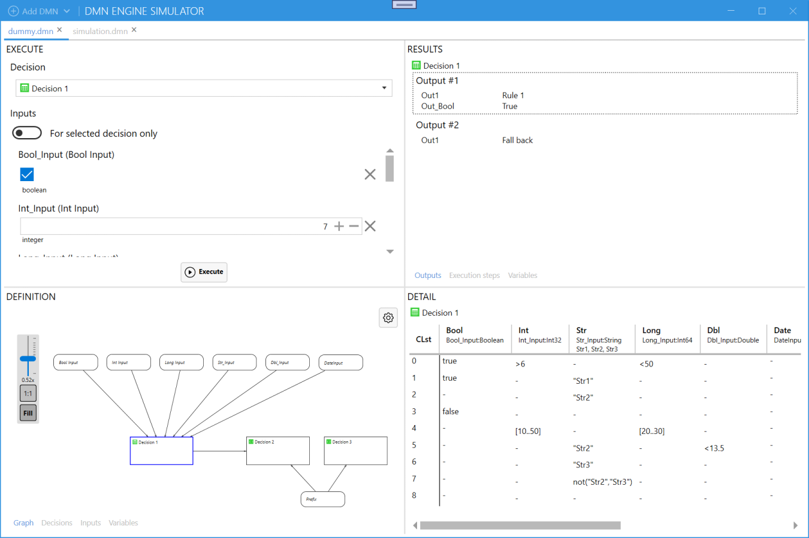

The Simulator parses the DMN XML file (it uses the `DmnParser.DmnVersionEnum.V1_3ext` when reading the DMN XML files) into the DMN definition and opens a workspace for the file. There can be multiple workspaces and even the single file can be opened in multiple workspaces.

Use the Add DMN drop down to add a DMN XML file. The drop down offers the `.dmn` files that are present in `dmn` folder of the application directory together with the (last) option to open DMN from file using the standard file open dialog.

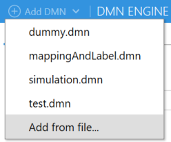

Each workspace has four panels with movable splitters between them.

### Definition ###
The definition panel provides the information about DMN definition. It shows *Graph* of the DMN, lists the decisions, inputs and variables.

The term *Graph* is used intentionally as it doesn't really depict the full DMN Diagram as in XML, but just the decisions and inputs (both selectable) with the edges representing the direct information requirements.

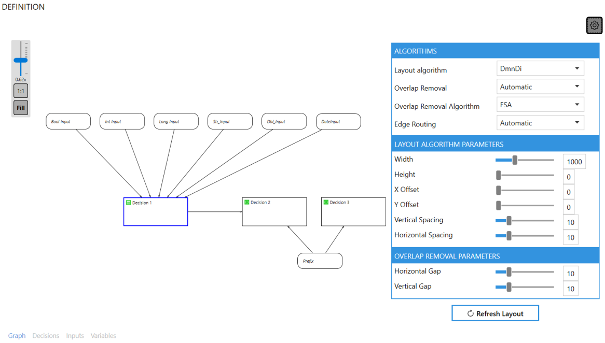

The [GraphShape](https://github.com/KeRNeLith/GraphShape) library is used for the visualization (also the `zoomcontrol` and configuration fly-out is reused with some minor changes from its demo application). The key addition to the ouot of the box GraphShape is a custom *DmnDi* layout algorithm that layouts the graph vertices (inputs and decisions) using the DMNDI (DMN Diagram) information from DMN XML (vertices without the related shape in DMNDI are positioned like a tiles within the boundary specified in *DmnDi* layout algorithm parameters). When any of inputs or decisions has the shape Extension, *DmnDi* algorithm is used by default, otherwise the *Tree* algorithm is used to layout the vertices within the graph.

The other tabs provides the very basic information about *Decisions*, *Inputs* and *Variables* (actually the inputs are just a subset of variables).
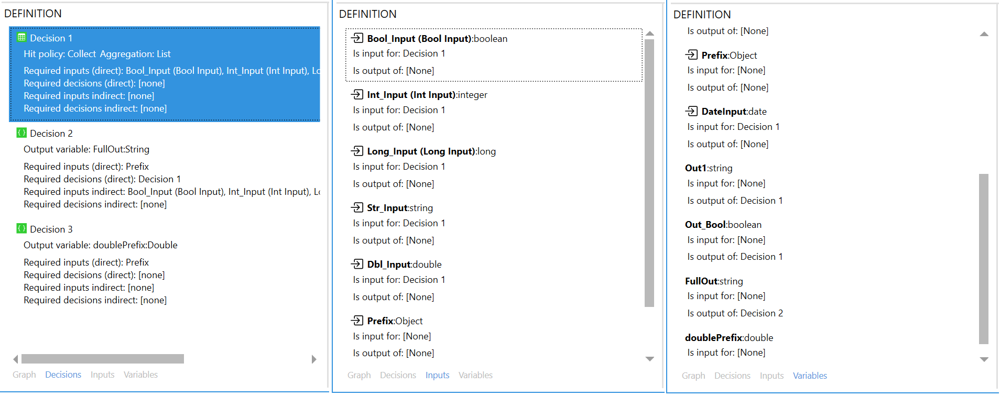

### Detail ###
The detail panel just presents the design of selected decision - table or expression

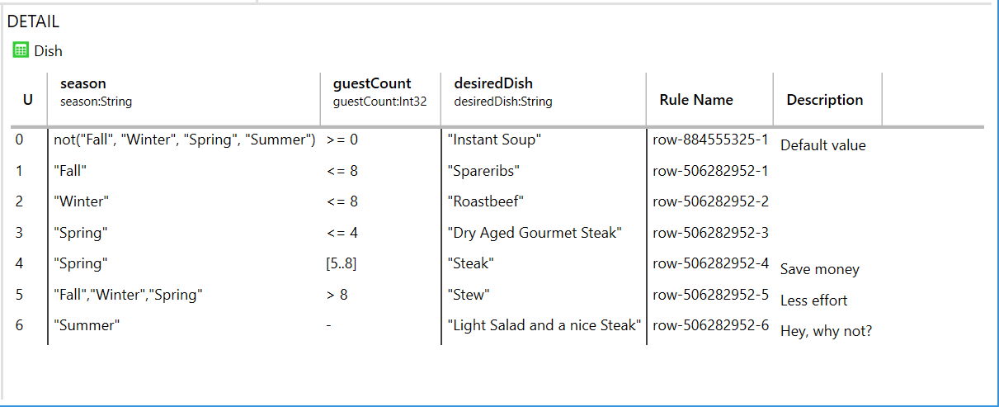

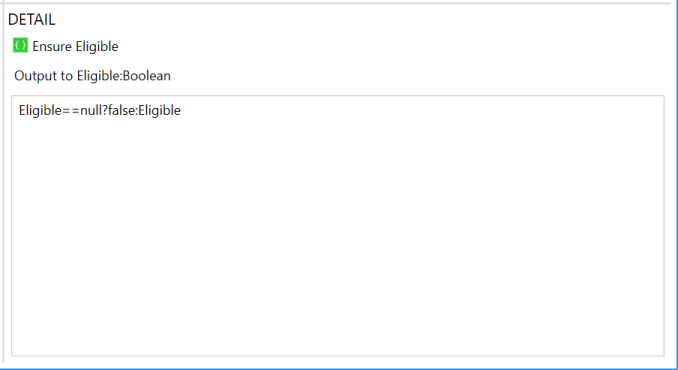

### Execute ###
The Simulator allows to try the decision with different inputs and see the execution results. To execute the decision simply choose the decision to execute, fill the inputs as needed (can be null, meaning the input value is not provided to execution context) and click to *Execute* button.

The specialized controls are used to enter the values of known types recognized by parser. When the type is not identified by parser from the definition (or it's identified but not as the know type), the entry is via text field and the combo box is provided to let the user choose a know type to which the raw value should be converted before passing to the execution context as the input parameter.

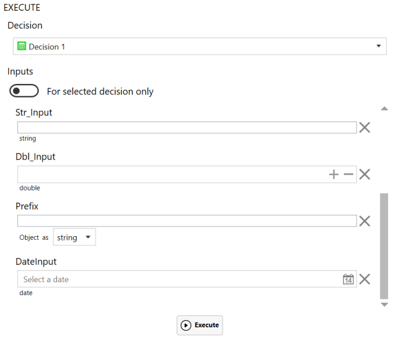

### Results
When a decision has been executed, the result outputs are shown. There can be no output, single output or multiple outputs and each output can also have zero, single or multiple output variables. All depending on the decision design and the input parameters.

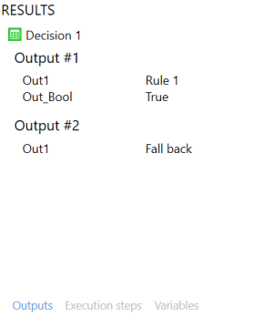

The execution context is configured to use the snapshots, so it's possible to trace the execution steps and see what were the outputs of that particular step (including the information about the rules that got hit in decision table) and the state of all variables at the end of the step, indicating the changes if any.

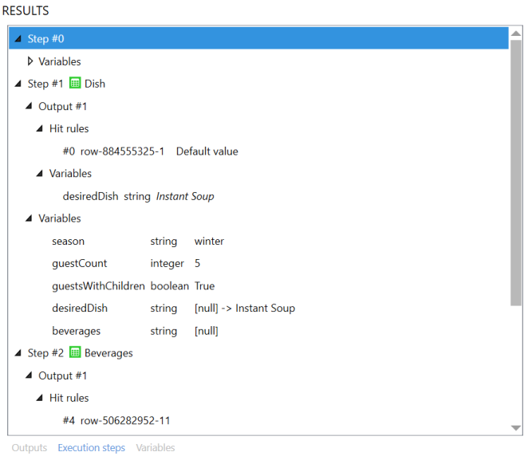

The other tracing view is through the variables, presenting the value after the whole execution together with the history how the value of such variable changed within the individual steps.

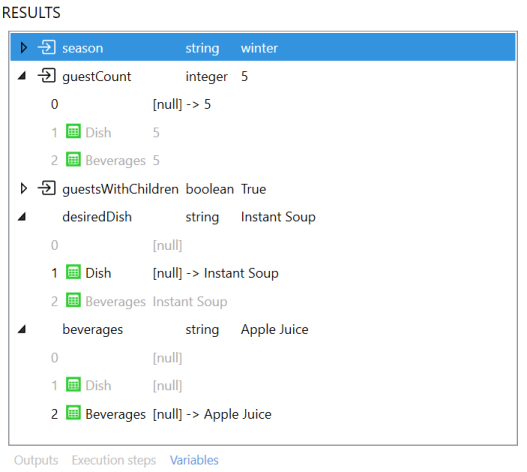